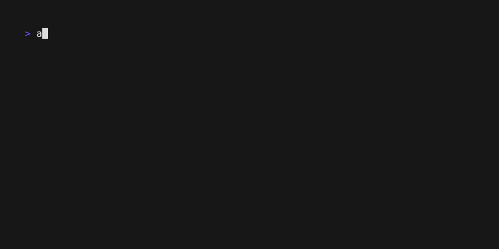

# asak

A cross-platform audio recording/playback CLI tool with TUI, written in Rust. The goal is to be an audio Swiss Army Knife (asak), like SoX but more interative and fun.



## install

> You need to have `cargo` installed, see [here](https://doc.rust-lang.org/cargo/getting-started/installation.html).

### step 1

```sh
cargo install asak
```

### step 2

```sh
asak --help
```

## usage

### record

```sh
asak rec hello
```

> If no output name is provided, a prompt will come for you to input output file name. UTC format such as `2024-04-14T09:17:40Z.wav` will be provided as initial file name.

### playback

```sh
asak play hello.wav
```

> If no input name is provided, it will search current directory for `.wav` files and open an interactive menu.

## roadmap?

- [x] record audio
- [x] basic audio playback
- [x] monitoring an input device with an output device
- [ ] rec device, dur, sr, ch, fmt
- [ ] play device, dur, sr, ch, fmt
- [ ] playback live pos control
- [ ] live amp + fx (reverb, delay, etc)
- [ ] passthru + live fx

## contribution

Just open an issue or PR, I'm happy to discuss and collaborate.
